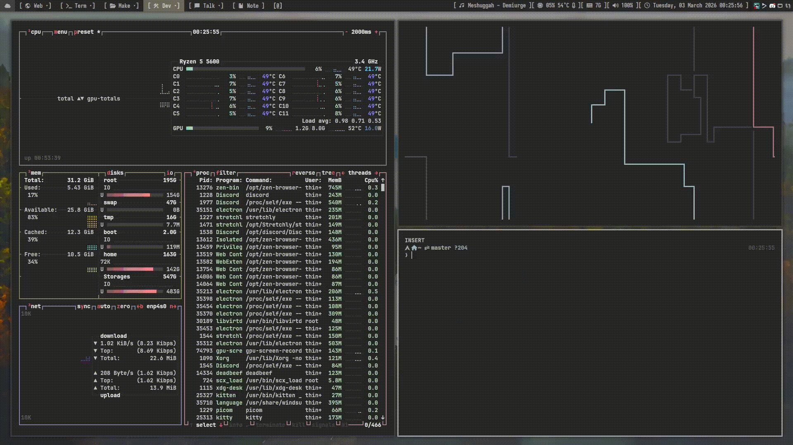
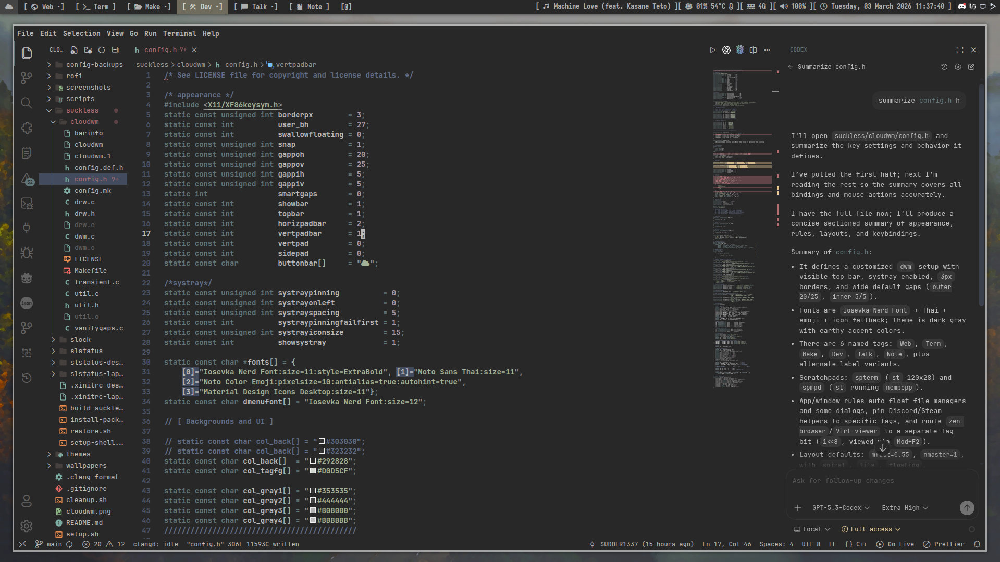
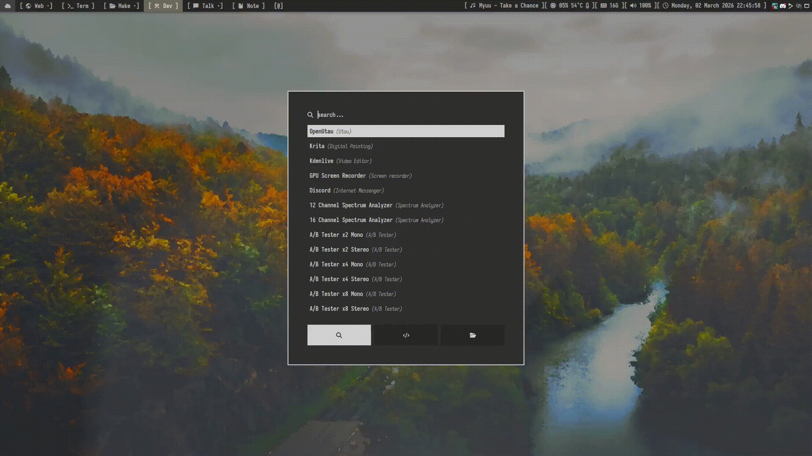

fjordwm is a customized version of suckless dwm with patches, themes, and scripts.
Forked from namishh's bedwm.

Screenshots (outdated !)
----------

| Terminal Setup | Development |
|----------------|-------------|
|  |  |

| Application Launcher | Lock Screen |
|---------------------|-------------|
|  |  |

Configuration
-------------
Edit suckless/fjordwm/config.h for colors, keybindings, layouts, and rules.
Edit suckless/dwl/config.def.h for the baseline `dwl` configuration, and `suckless/dwl/config.mk` for build flags such as XWayland.

Profiles
--------
- Desktop: all status bar modules enabled
- Laptop: fewer status bar modules
  
Applied Patches
---------------
- `actualfullscreen`
- `autostart`
- `barheight`
- `barpadding`
- `cfacts`
- `cyclelayouts`
- `pertag`
- `scratchpads`
- `status2d`
- `statusbutton`
- `statuscmd`
- `statuspadding`
- `swallow`
- `systray`
- `systray-iconsize`
- `underline-tags`
- `vanitygaps`

Included Features
-----------------
- Alternative tag labels via `alttags`
- Per-tag color styling for the active tag palette
- No separate window-title area in the bar
- Layout set includes `tile`, `floating`, `monocle`, `spiral`, `dwindle`, and `centeredmaster`
- Floating scratchpads are centered when shown
- Floating windows are re-centered when geometry would push them off-screen

Requirements
------------
- gcc, make, git
- fzf for interactive setup
- sudo

Installation
------------
    git clone https://github.com/SUDOER1337/fjordwm.git
    cd fjordwm
    ./setup.sh

Minimal Clone Options
---------------------
If you only want part of the repository, use Git sparse checkout. This is optional and client-side; the repo does not force partial clone behavior.

Window manager only (manual build/config work):

    git clone --filter=blob:none --no-checkout https://github.com/SUDOER1337/fjordwm.git
    cd fjordwm
    git sparse-checkout init --cone
    git sparse-checkout set suckless/fjordwm
    git checkout main
    cd suckless/fjordwm
    make clean install

Wayland compositor only (manual build/config work):

    git clone --filter=blob:none --no-checkout https://github.com/SUDOER1337/fjordwm.git
    cd fjordwm
    git sparse-checkout init --cone
    git sparse-checkout set suckless/dwl
    git checkout main
    ./suckless/build-suckless.sh --wm dwl --install-mode local --yes

Window manager + rofi (manual build plus launcher configs):

    git clone --filter=blob:none --no-checkout https://github.com/SUDOER1337/fjordwm.git
    cd fjordwm
    git sparse-checkout init --cone
    git sparse-checkout set suckless/fjordwm rofi
    git checkout main

Full experience minus heavy assets (recommended if you still want `./setup.sh`):

    git clone --filter=blob:none --no-checkout https://github.com/SUDOER1337/fjordwm.git
    cd fjordwm
    git sparse-checkout init --cone
    git sparse-checkout set suckless rofi scripts themes config-backups README.md setup.sh
    git checkout main
    ./setup.sh

Skipping `wallpapers/` and `screenshots/` reduces download size, but you will not get the bundled wallpapers or media assets.

The setup script supports both interactive and flag-driven installs:

    ./setup.sh --task all --profile desktop --yes
    ./setup.sh --task config --configs rofi,kitty,nvim
    ./setup.sh --task config --configs all --yes
    ./setup.sh --task packages --wm dwl --yes
    ./setup.sh --task build --wm dwl --yes
    ./setup.sh --task betterdiscord --yes

Available tasks:
- `all`: packages, build, selected config install, shell setup, and post-setup tasks
- `packages`: install packages only
- `build`: build the selected window-manager stack
- `config`: install config backups from `config-backups/` using `all` or a selected subset
- `shell`: install the fish shell configuration
- `post`: apply GUI-only post-setup tweaks
- `betterdiscord`: install Discord, install/update BetterDiscord, and apply the bundled theme

Available window-manager targets:
- `fjordwm`: current X11 stack (`fjordwm`, `slock`, `slstatus`)
- `dwl`: Wayland compositor only, installed locally by default
- `both`: build both stacks; `--profile` is still required for the `fjordwm` side

Components
----------
- Window manager: dwm with patches
- Wayland compositor: fjordwl (local dwl fork) with XWayland enabled in `config.mk`
- Status bars: native `dwm` bar on fjordwm (X11), Waybar on fjordwl by default
- Notifications: dunst on fjordwm, swaync on fjordwl by default
- Application launcher: rofi with custom themes and a Utility menu
- GTK theme: Carbon-Square
- BetterDiscord theme: bundled `achromatic24` theme + `custom.css`
- Terminal: kitty
- Compositor: picom
- Lock screen: slock

Rofi Navigation
---------------
- Selection-only rofi menus use plain `h/j/k/l` for list navigation in addition to arrow keys.
- Launchers and text-entry rofi prompts use `Alt+h/j/k/l` so typing `h`, `j`, `k`, and `l` still works normally.

Recommendations
--------------

| Application | Purpose | Package |
|-------------|---------|---------|
| nwg-look | GTK settings | nwg-look |
| warpd | Vim-style cursor control | warpd |
| nm-applet | Network tray icon | network-manager-applet |
| unclutter | Hide idle cursor | unclutter |
| redshift | Blue light filter | redshift |
| flameshot | Screenshots | flameshot |
| udiskie | USB auto-mount | udiskie |
| rmpc | Rust TUI MPD client | mpd rmpc mpd-mpris |
| sddm | Display manager for X11/Wayland session selection | sddm |

Build
-----
After config changes to the X11 stack:

    cd suckless/fjordwm
    make clean install

For the Wayland path:

    ./suckless/build-suckless.sh --wm dwl --install-mode local --yes

The `dwl` build installs the compositor into `~/.local/bin` and the session file into `~/.local/share/wayland-sessions` when using local mode.

SDDM
----
If you want a display manager, install `sddm` and enable it:

    ./suckless/install-packages.sh --wm both --optional sddm
    sudo systemctl enable --now sddm.service

`fjordwm` installs an X11 session into `xsessions/`, and `fjordwl` installs a Wayland session into `wayland-sessions/`, so both show up in SDDM after installation.

Under SDDM, the `fjordwm` session now starts through the bundled session script instead of `~/.xinitrc`. `startx` still uses `~/.xinitrc`, so manual X11 startup remains unchanged.

Troubleshooting
---------------

Build fails with permissions:
    sudo chown -R $USER:$USER ~/fjordwm
    chmod +x ~/fjordwm/scripts/*.sh

Status bar not updating:
    cd ~/fjordwm/suckless/fjordwm && make clean install

GTK theme missing:
    cp -r ~/fjordwm/themes/Carbon-Square ~/.themes/

Keybindings not working:
    echo $XDG_CURRENT_DESKTOP
    echo $DESKTOP_SESSION

Files
-----
- suckless/fjordwm/config.h - main configuration for fjordwm and its native bar
- suckless/dwl/config.def.h - baseline dwl configuration
- suckless/dwl/config.mk - dwl build flags and XWayland toggle
- suckless/install-betterdiscord.sh - BetterDiscord installer and theme sync
- scripts/ - utility scripts
- rofi/ - application launcher and larger menu configurations
- themes/ - GTK theme files
