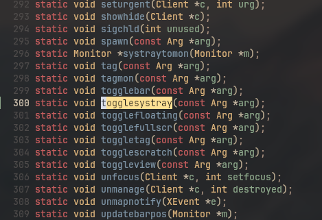
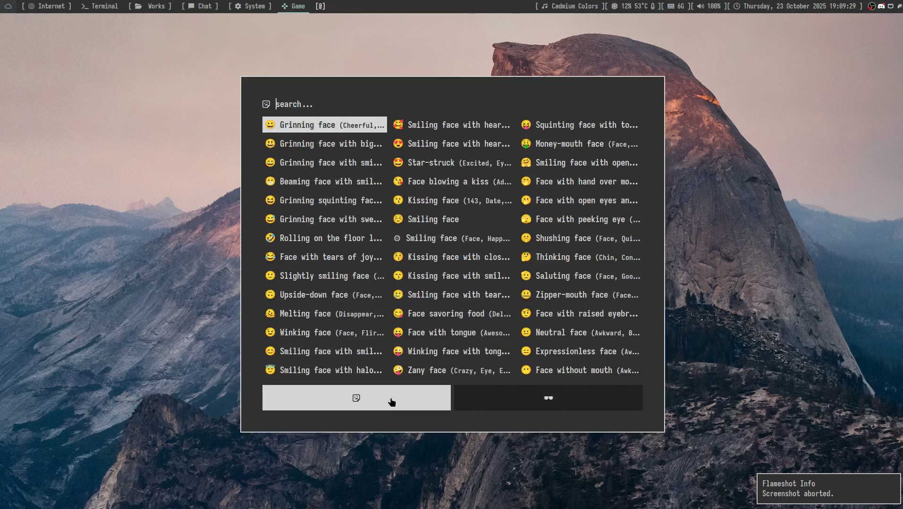
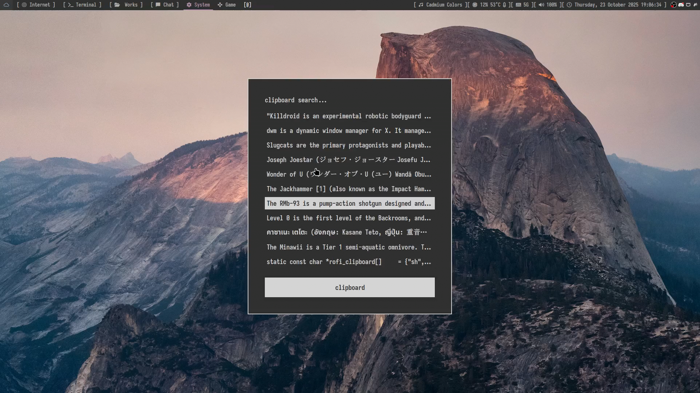
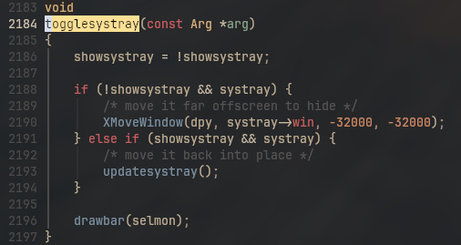

```
   _____  _       ____   _    _  _____ __          __ __  __ 
  / ____|| |     / __ \ | |  | ||  __ \\ \        / /|  \/  |
 | |     | |    | |  | || |  | || |  | |\ \  /\  / / | \  / |
 | |     | |    | |  | || |  | || |  | | \ \/  \/ /  | |\/| |
 | |____ | |____| |__| || |__| || |__| |  \  /\  /   | |  | |
  \_____||______|\____/  \____/ |_____/    \/  \/    |_|  |_|
                                                             
```
### A reproducible minimalistic dwm repo for you to fork and customize

cloudwm is a customized version of [suckless's dwm](https://git.suckless.org/dwm) (Dynamic Window Manager) configuration with extensive patches, themes, and automation scripts for a complete desktop experience.

The cloudwm source folder has configurations customized for both laptop and desktop setups. Rofi configurations are stored in the cloudwm folder, with only `config.rasi` that goes into `~/.config/rofi`

Forked from [`namishh's bedwm`](https://github.com/namishh/dwm)

## Table of Contents
- [📸 Gallery & Screenshots](#-gallery--screenshots)
- [Installation](#installation)
- [Configuration](#configuration)
- [Patches](#patches)
- [Troubleshooting](#troubleshooting)
- [Backup & Restore](#backup--restore)

## Features

- **Custom DWM Build**: Selective pick of patch originally by [namishh](https://github.com/namishh/dwm)
- **Automated Setup**: One-command installation with profile selection via TUI
- **Theme**: GTK theme, icons, and cursor theme
- **Backup System**: Automatic configuration backup before changes
- **Status Bar**: Clean slstatus with custom modules
- **Application Launcher**: Custom Rofi themes and launchers
- **Window Management**: Fixed but adjustable layouts, gaps, and scratchpads

## 📸 Gallery & Screenshots

### Desktop Experience Overview
<div align="center">

|  |  |
|-------------------------------------|--------------------------------------|
| **Multi-terminal workspace** with efficient tiling | **VS Codium** with the "Nullfjord" theme |

|  |  |
|-------------------------------------|--------------------------------------|
| **Rofi Launcher** with custom styling | **System Control** for quick settings |

|  |  |
|-------------------------------------|--------------------------------------|
| **Custom Lock Screen** with time display | **Tray Management** with toggle functionality |

</div>

### Interactive Elements

|  |  |
|-------------------------------------|--------------------------------------|
| **Emoji Selection** integrated into launcher | **Clipboard History** management |

|  |
|-------------------------------------|
| **Advanced Tray Controls** for system components |


## System Components

- **Window Manager**: [dwm](https://git.suckless.org/dwm) with custom patches
- **Compositor**: `picom` for transparency and effects
- **Terminal**: `kitty` with custom configuration
- **Lock Screen**: slock with readpw() and draw_time() modified from ['DPatel0211's dotfiles'](https://github.com/DPatel0211/dotfiles)
- **Fonts**: Cozette, Iosevka Nerd Font, JetBrainsMono Nerd Fonts
- **GTK Theme**: `Carbon-Square` - a dark boxy GTK theme created using oomox
- **Cursor Theme**: `Bibata-Modern-Classic`
- **Icons**: YAMIS icon set
- **Launchers**: Edited ['adi1090x collection of Rofi custom Applets, Launchers & Powermenus'](https://github.com/adi1090x/rofi)

## Themes

### GTK Theme Installation
```bash
cp -r ~/cloudwm/themes/Carbon-Square ~/.themes/
```

### Additional Customizations
- **Zen Browser**: Custom userChrome.css for square interface
- **Discord**: Theme based on System24 for BetterDiscord

## Recommended Applications

| Application | Purpose | Package Name |
|-------------|---------|--------------|
| Network Manager | WiFi tray icon | `nm-applet` |
| Hide cursor | Auto-hide cursor when idle | `unclutter` |
| Night Light | Blue light filter | `redshift` |
| Screenshots | Screen capture tool | `flameshot` |
| Auto-mount | USB drive mounting | `udiskie` |
| GTK Settings | Theme configuration | `nwg-look` |
| Music Player | GUI audio player | `deadbeef deadbeef-mpris2-plugin` |

## Installation

### Prerequisites
- Arch Linux-based distribution (or compatible)
- Basic development tools: `gcc`, `make`, `git`
- `fzf` for interactive menus
- `sudo` or `doas` access for system-wide installation

### Quick Install
```bash
git clone https://github.com/SUDOER1337/cloudwm.git
cd cloudwm
./setup.sh
```

### Installation Process
1. Run the installation script: `~/cloudwm/setup.sh`
2. An fzf prompt will pop up asking you to select:
   - **Desktop**: Full-featured configuration
   - **Laptop**: Optimized for battery life and space
3. The script will automatically build and configure the selected profile

> **Note**: The setup automatically creates backups of existing configurations. See [BACKUP_README.md](BACKUP_README.md) for backup/restore information.

## Patches

| Patch | Description |
|--------|-------------|
| ActualFullscreen | Proper fullscreen support without decorations |
| AltTagsDecoration | Alternative tag decoration style |
| Alwayscenter | Center new windows by default |
| BarPadding | Add padding around status bar |
| BarHeight | Customizable status bar height |
| Cfacts | Client factoring for proportional resizing |
| CycleLayouts | Cycle through available layouts |
| NoTitle | Remove window title bars |
| RainbowTags | Colored tag indicators |
| ScratchPads | Dropdown terminal and music player |
| Status2d | Enhanced status bar with 2D graphics |
| StatusButton | Clickable status bar items |
| StatusPadding | Padding around status text |
| StatusCmd | Custom status bar commands |
| Swallow | Parent-child window management |
| Systray-Iconsize | Customizable system tray icon size |
| UnderlineTags | Underline active tags instead of highlighting |
| Vanitygaps | Configurable window gaps |

## Configuration

### Main Configuration File
Edit `suckless/cloudwm/config.def.h` for:
- Colors and themes
- Keybindings and shortcuts
- Layout preferences
- Application rules
- Status bar components
- Scratchpad configurations

### Profile Differences
- **Desktop**: Full feature set with all status bar modules
- **Laptop**: Optimized settings for mobile use

### Customization Examples
```c
// Change colors
static const char col_back[] = "#1a1a1a";
static const char col_fore[] = "#ffffff";

// Add custom keybinding
{ MODKEY, XK_w, spawn, SHCMD("firefox") },
```

## Troubleshooting

### Common Issues

**Build fails with permission errors**
```bash
sudo chown -R $USER:$USER ~/cloudwm
chmod +x ~/cloudwm/scripts/*.sh
```

**Sudo not working in container**
The build script offers alternatives:
- Use "Build only" option for manual installation
- Install to `~/.local/bin` for user-level installation

**Status bar not updating**
```bash
# Restart slstatus
killall slstatus && slstatus &
```

**Window decorations missing**
Check that GTK theme is properly installed:
```bash
ls ~/.themes/Carbon-Square
cp -r ~/cloudwm/themes/Carbon-Square ~/.themes/
```

**Keybindings not working**
Verify DWM is running (not another WM):
```bash
echo $XDG_CURRENT_DESKTOP
echo $DESKTOP_SESSION
```

## Backup & Restore

cloudwm includes an automatic backup system that protects your existing configurations. See [BACKUP_README.md](BACKUP_README.md) for detailed instructions.

### Manual Backup
```bash
./scripts/backup-configs.sh
```

### Manual Restore
```bash
./scripts/restore-configs.sh
```
## Support

For issues and questions:
- Check the [Troubleshooting](#troubleshooting) section first
- Review existing GitHub issues
- Create detailed bug reports with system information

---

Feel free to fork! 🚀
