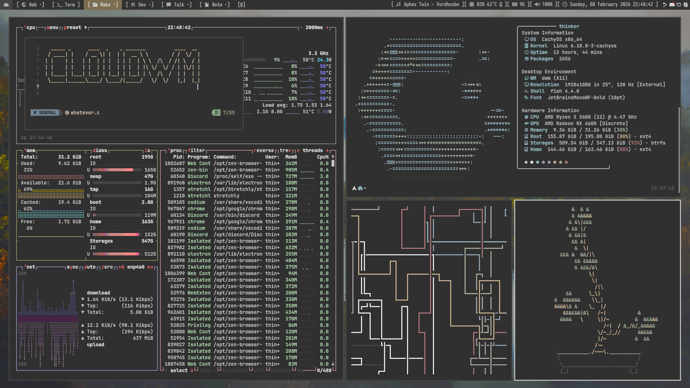
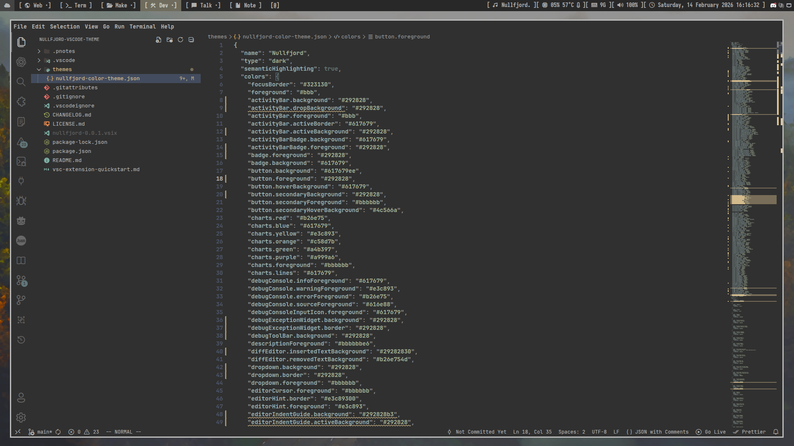
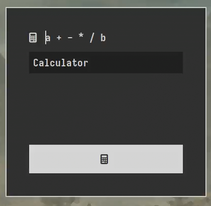
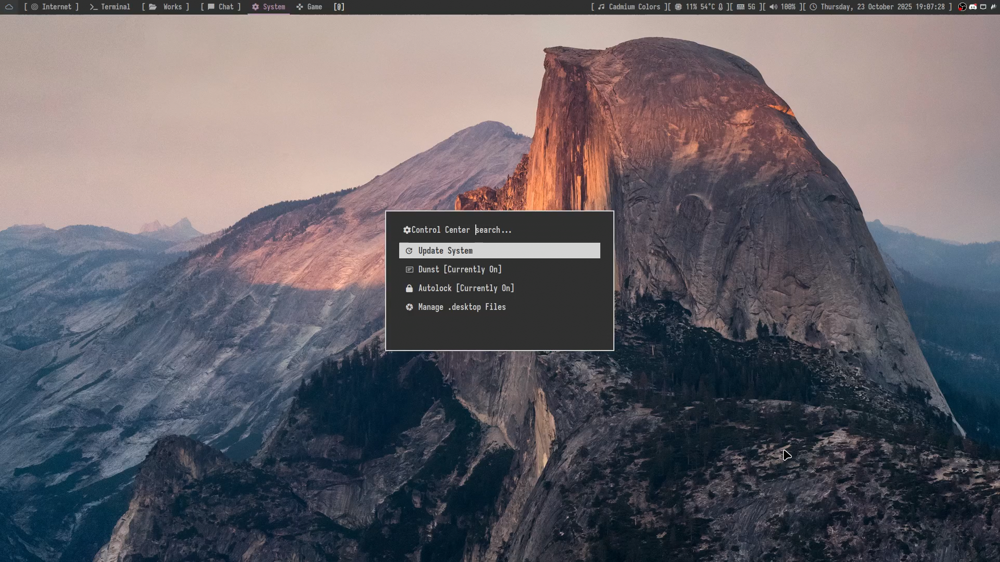

customized dwm build
==============================

cloudwm is a customized version of suckless dwm with patches, themes, and scripts.
Forked from namishh's bedwm.

Requirements
------------
- gcc, make, git
- fzf
- sudo or doas

Installation
------------
    git clone https://github.com/SUDOER1337/cloudwm.git
    cd cloudwm
    ./setup.sh

The setup script will prompt for profile selection:
- Desktop: full configuration
- Laptop: optimized for mobile use

Screenshots
----------

| Terminal Setup | Development |
|----------------|-------------|
|  |  |

| Application Launcher | Control Center |
|---------------------|----------------|
|  |  |

Configuration
-------------
Edit suckless/cloudwm/config.def.h for colors, keybindings, layouts, and rules.

Profiles
--------
- Desktop: all status bar modules enabled
- Laptop: optimized settings for battery life

Patches
-------

| Patch | Description |
|-------|-------------|
| ActualFullscreen | Proper fullscreen without decorations |
| AltTagsDecoration | Alternative tag decoration |
| Alwayscenter | Center new windows |
| BarPadding | Padding around status bar |
| BarHeight | Customizable bar height |
| Cfacts | Client factoring for resizing |
| CycleLayouts | Cycle through layouts |
| NoTitle | Remove window titles |
| RainbowTags | Colored tag indicators |
| ScratchPads | Dropdown terminal and music player |
| Status2d | Enhanced status bar graphics |
| StatusButton | Clickable status items |
| StatusPadding | Padding around status text |
| StatusCmd | Custom status commands |
| Swallow | Parent-child window management |
| Systray-Iconsize | Customizable tray icons |
| UnderlineTags | Underline active tags |
| Vanitygaps | Configurable window gaps |

Components
----------
- Window manager: dwm with patches
- Status bar: slstatus with custom modules
- Application launcher: rofi with custom themes
- GTK theme: Carbon-Square
- Terminal: kitty
- Compositor: picom
- Lock screen: slock

Recommendations
--------------

| Application | Purpose | Package |
|-------------|---------|---------|
| nwg-look | GTK settings | nwg-look |
| warpd | Vim-style cursor control | warpd |
| nm-applet | Network tray icon | network-manager-applet |
| unclutter | Hide idle cursor | unclutter |
| redshift | Blue light filter | redshift |
| flameshot | Screenshots | flameshot |
| udiskie | USB auto-mount | udiskie |
| deadbeef | Music player with mpris2 | deadbeef deadbeef-mpris2-plugin |

Build
-----
After config changes:

    cd suckless/cloudwm
    make clean install

Troubleshooting
---------------

Build fails with permissions:
    sudo chown -R $USER:$USER ~/cloudwm
    chmod +x ~/cloudwm/scripts/*.sh

Status bar not updating:
    killall slstatus && slstatus &

GTK theme missing:
    cp -r ~/cloudwm/themes/Carbon-Square ~/.themes/

Keybindings not working:
    echo $XDG_CURRENT_DESKTOP
    echo $DESKTOP_SESSION

Files
-----
- suckless/cloudwm/config.def.h - main configuration
- suckless/cloudwm/config.h - active configuration
- scripts/ - utility scripts
- rofi/ - application launcher configurations
- themes/ - GTK theme files
