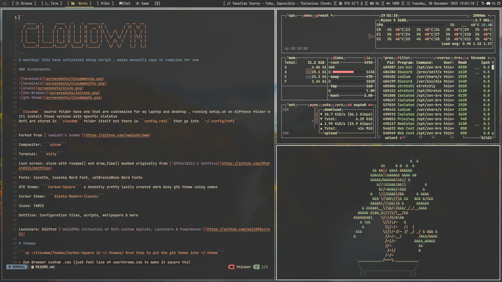
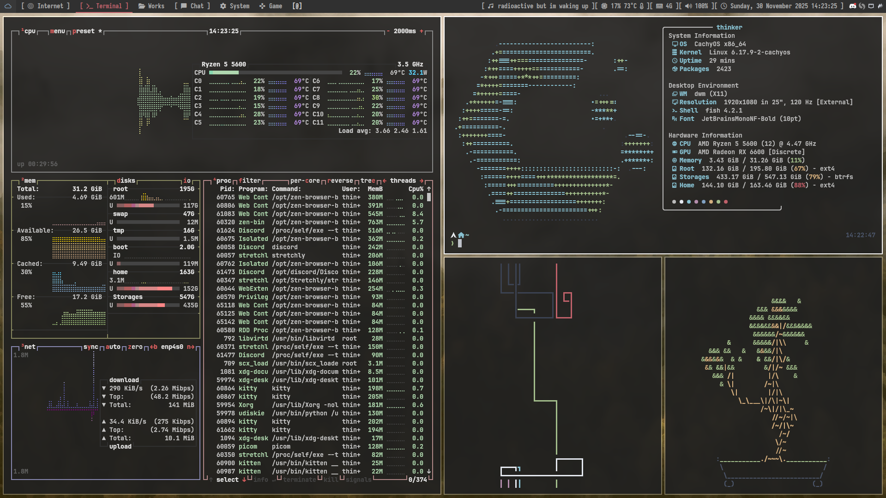
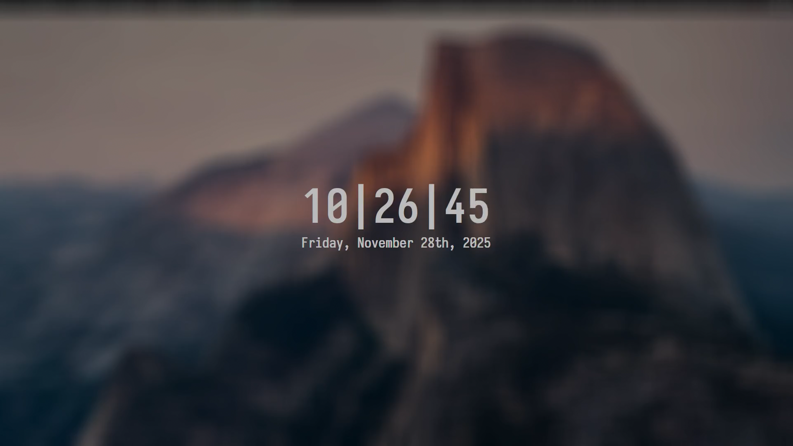
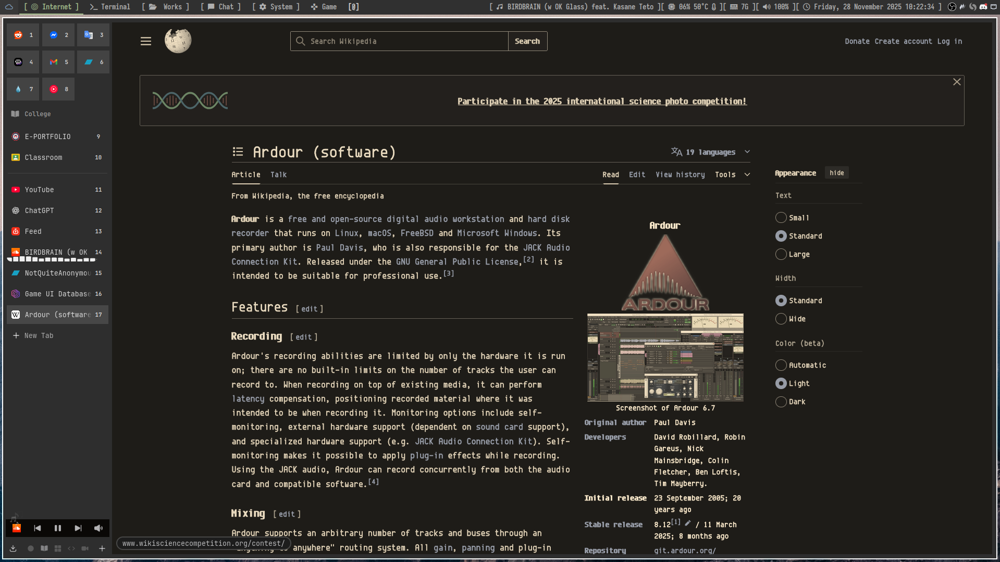
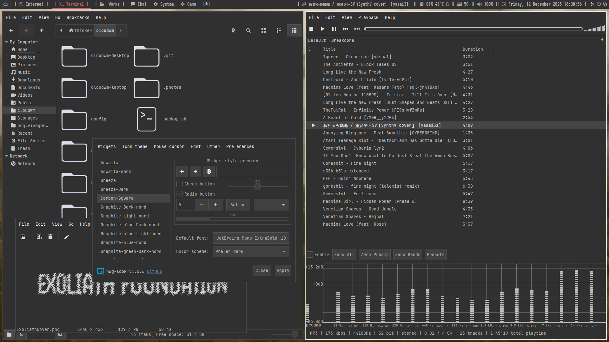

```
   _____  _       ____   _    _  _____ __          __ __  __ 
  / ____|| |     / __ \ | |  | ||  __ \\ \        / /|  \/  |
 | |     | |    | |  | || |  | || |  | |\ \  /\  / / | \  / |
 | |     | |    | |  | || |  | || |  | | \ \/  \/ /  | |\/| |
 | |____ | |____| |__| || |__| || |__| |  \  /\  /   | |  | |
  \_____||______|\____/  \____/ |_____/    \/  \/    |_|  |_|
                                                             
```
# warning! this have unfinished setup script , maybe manually copy or complies for now

### Screenshots
 







``cloudwm`` source folder have one that are customized for my laptop and desktop , running setup.sh on diffence folder will install those version with specfic slstatus
Rofi are stored in ``cloudwm`` folder itself but there is ``config.rasi`` that go into ``~/.config/rofi``


Forked from [`namishh's bedwm`](https://github.com/namishh/dwm)

Compositor: ```picom```

Terminal: ```kitty```

Lock screen: slock with readpw() and draw_time() modded originally from ['DPatel0211's dotfiles](https://github.com/DPatel0211/dotfiles)

Fonts: Cozette, Iosevka Nerd Font, JetBrainsMono Nerd Fonts

GTK theme: ```Carbon-Square``` a honestly pretty lazily created dark boxy gtk theme using oomox

Cursor theme: ```Bibata-Modern-Classic```

Icons: YAMIS

Dotfiles: Configuration files, scripts, wallpapers & more


Launchers: Editted ['adi1090x collection of Rofi custom Applets, Launchers & Powermenus'](https://github.com/adi1090x/rofi)

# Themes

```cp ~/cloudwm/Themes/Carbon-Square in ~/.themes/ #run this to put the gtk theme into ~/.theme```

> Zen Browser custom .css (just feel line of userChrome.css to make it square tho)
> Discord theme based on System24 for Betterdiscord 

## Recommandation

```deadbeef deadbeef-mpris2-plugin``` personally my fav gui music player

```nm-applet``` wifi tray icon

```flameshot``` screenshot tool

```udiskie``` automount drive

```nwg-look``` for gtk settings

## Installation

Run the installation script:

```~/cloudwm/setup.sh```

a fzf prompt should pops up

and ask if you want to install Desktop or Laptop version and will build and clone config automatically

## Patches
+ ActualFullscreen
+ AltTagsDecoration
+ Alwayscenter
+ BarPadding
+ BarHeight
+ Cfacts
+ CycleLayouts
+ NoTitle
+ RainbowTags
+ ScratchPads
+ Status2d
+ StatusButton
+ StatusPadding
+ StatusCmd
+ Swallow
+ Systray-Iconsize
+ UnderlineTags
+ Vanitygaps

All configuration is done by editing the source code files:

    config.h – Main configuration file

    scripts/ – Helper scripts for automation

Feel free to forks!
