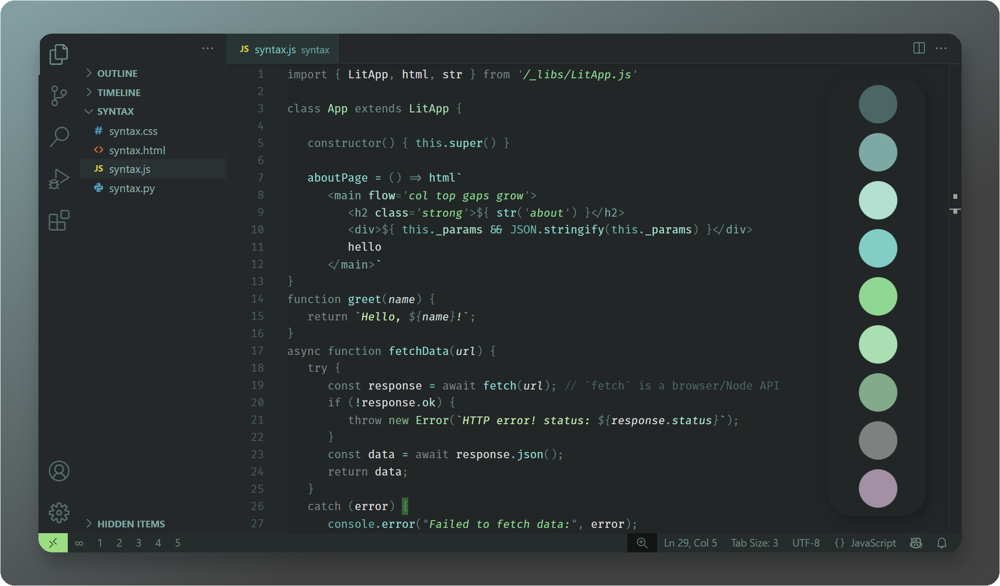
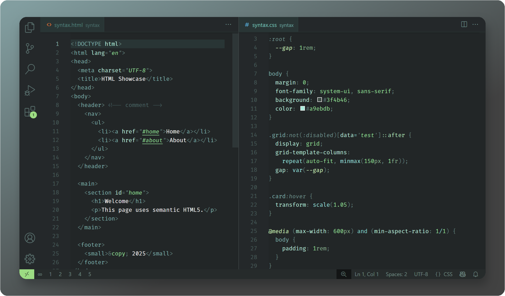
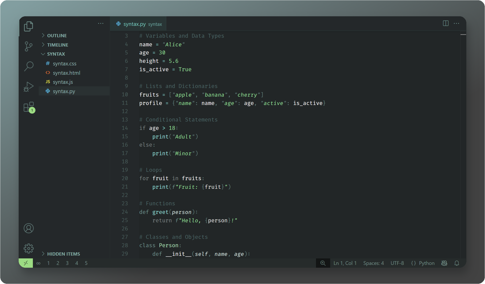
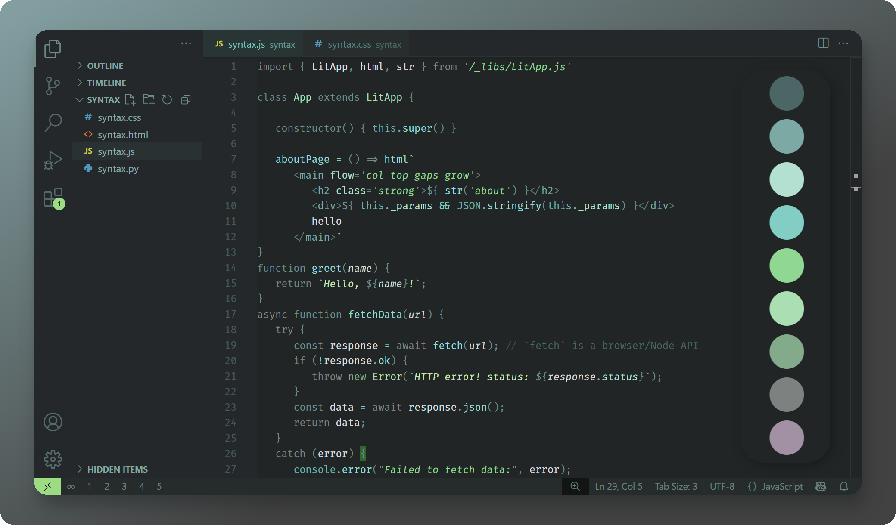
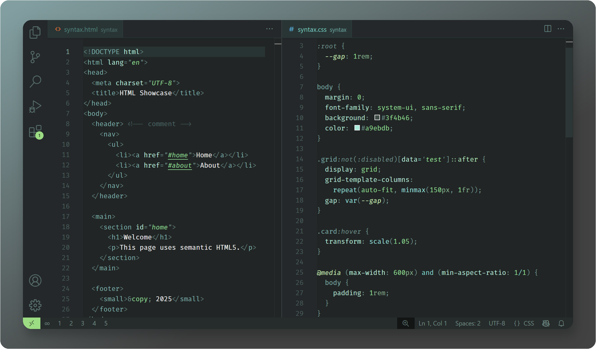
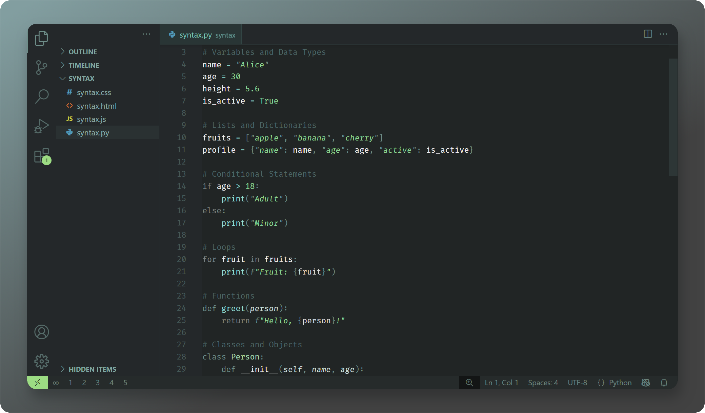
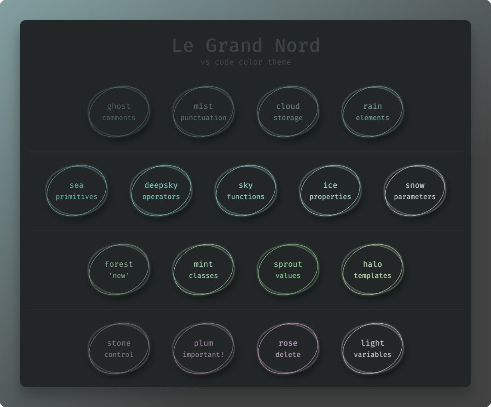

# Le Grand Nord – Un thème pour VS Code

[🌍 English](README.md)

**Pour une vision claire, sans distraction.**

Le Grand Nord est un thème magnifique et minimaliste, pensé pour le confort visuel et la concentration. Inspiré et inspirant avec ses tons nordiques et une palette simple, ce thème offre un espace serein et immersif — tel un jardin zen où la créativité coule naturellement. 🌱

## Le Grand Nord

### Javascript

> [!NOTE]
> Capture faite avec l'extension pour VS Code `lit-html` installée afin d'obtenir une coloration syntaxique approprié à l'intérieur des *tagged templates* ( <code>html\`&lt;div>…&lt;/div>\`</code>)

### HTML / CSS

### Python

## Le Grand Nord – Higher Contrast

Ce thème a un arrière-plan légèrement plus sombre et une ponctuation plus claire.

### Javascript

### HTML / CSS

### Python

<!-- ## Palette de couleurs

 -->

---

Si vous utilisez et appréciez ce thème, pensez à laisser une évaluation sur le [Visual Studio Code Marketplace](https://marketplace.visualstudio.com/items?itemName=ncodefun.le-grand-nord). Votre soutien est grandement apprécié ! 💖

---

**Tags**: *nord, flow, concentration, focus, zen, simple, sérénité, élégant, harmonieux*

## Licence

[MIT](LICENSE)
